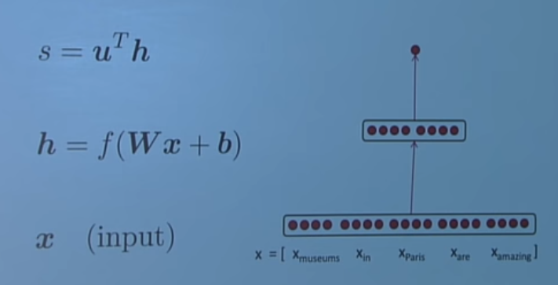

首先讲了神经网络的一些基本知识，并且如何用神经网络来计算word vector： 针对于nlp任务，相当于既需要更新w，又需要更新x，实际上增加一层embedding即可。

### named entity recognition(NER)

将其转为分类问题，在有上下文文本的情况下，对每个word分类。很多entity是多个word，最简单的方法是相邻的分为相同类别的单词作为一个entity。

定义一个word window, 如window length=2，

... museums in Pairs are amazing ....

$x_{window} = [x_{museums}, x_{in}, x_{Pairs}, x_{are}, x_{amazing}]^T$

最后将这五个vector concatenate在一起，得到一个新的vector，$x_{window} = x∈R^{5d}$，一个新的列向量。

可以用softmax解决这个问题。

neural NLP一篇早起文章，binary classification with unnormalized scores， Collobert&Weston.

判断location的位置，如果window的中心是location，则标签为1，如果不是，标签为0.

优化方法仍然是SGD。