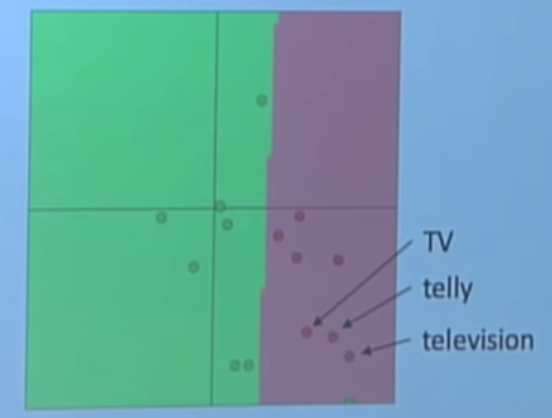
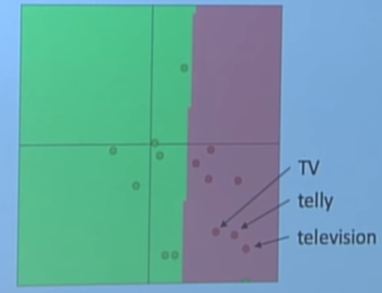

### Backpropagation and Computation Graphs

这节课继续讲了如何应用链式法则求梯度。 

但是对于NLP问题中，更新word vector matrix时候是sparse的，很多word vector没有被更新。

可以通过更新word的梯度，来完成监督问题。不过，下面是一种不能正常工作的情况。

但是训练集中，只有TV和telly，测试集中，有television。pretrained word vectore有这三者。

这就会导致在training的时候，只有TV和telly的权重被更新，而television的不变，如下图所示。

***那我们是否应当用已有的pretrained word vectors呢？***

- 答案是当然应该。
- pretrained word vector通常是用很大数量的数据进行训练的，它会掌握训练集中没有的单词信息，也会知道训练集中已有的单词。
- 如果你要训练的数据非常大，比如1个亿，那么你可以随机开始。

***是否应当更新（fine tune）我自己的word vector呢？***

- 如果你只有很小的数据作训练集，那么不要训练word vector。
- 如果有一个很大的数据集，可能*训练/更新/finetune* word vector会更好。

后面讲了一些前向反向传播，激活函数参数初始化、优化器、学习率等相关的知识。
