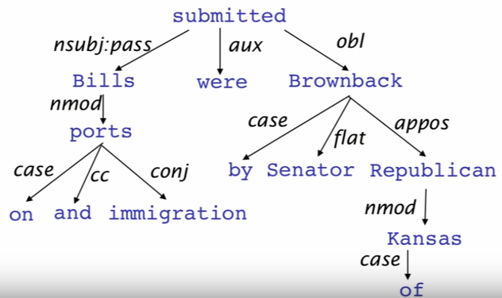

## 《Linguistic Structure: Dependency Parsing 》 ##

### phrase structure

**starting unit: word**

    the, cat, cuddly, by, door

**words combine into phrases**

    the cuddly cat, by the door

**phrases can combine into bigger phrases**

    the cuddly cat by the door

可以将一些phrases组成一个更大的phrase.

--------
## Dependency Grammar

Dependency syntax假设syntactic structure包含了lexical item之间的关系，通常为binary asymmetric relation，叫做**dependencies**。

箭头开始的地方是Dependency的head（被修饰的主题），箭头指向的地方是dependent（修饰语）。通常会添加一个fake root。

Dependency Grammar非常早就有了，相比他们context-free Grammar和phrase structure Grammar比较新。

如何来选择特征呢？一般而言，依存句法分析的可用特征：
1. Bilexical affinities（双词汇亲和，即有意义的词汇）
2. Dependency distance（依存距离，一般倾向于距离近的）
3. Intervening material（标点符号两边的成分可能没有相互关系）
4. Valency of heads （词语配价，对于不同词性依附的词的数量或者依附方向） 

### Dependency Parsing(依存关系分析)

每个单词都会是另一个单词（包含root）的dependent。最终生成一棵树，没有循环。有时候arrow可能会跨过另一个（non-projective）。

本节课主要讲了transition-based pasring。但是之后可以用machine learning的方法来解决这个问题。每个action都用一个分类器来预测。

手动构建feature存在以下问题：
1. sparse
2. incomplete
3. expensive computation

用neural dependency parsar可以极大地提高句法分析的速度。

除了需要将word表示成vector之外，还需要将part-of-speech tags（POS）和dependency labels表示成d-dimensional vectors。

之后，又有一些相关的改进工作，如用更深的网络、beam search，用global CRF inference代替决策序列等。