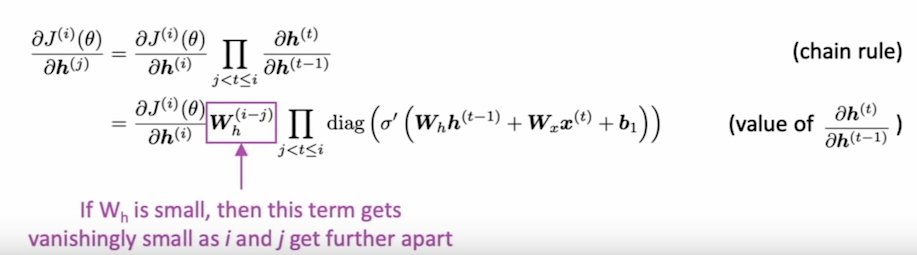
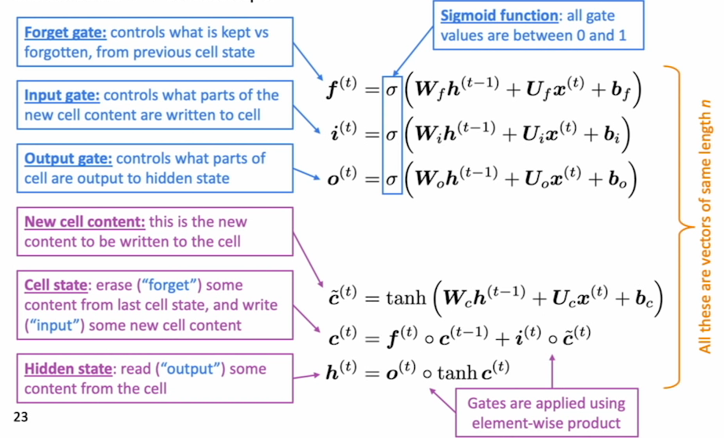
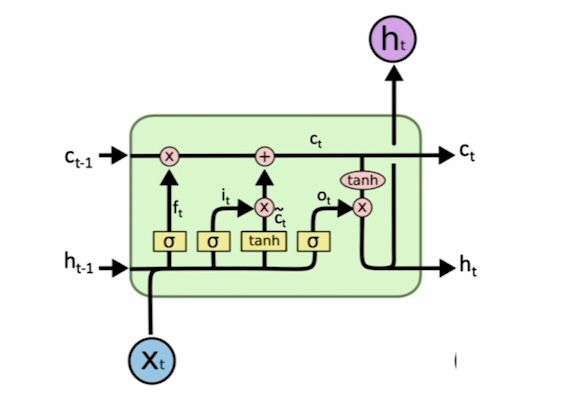
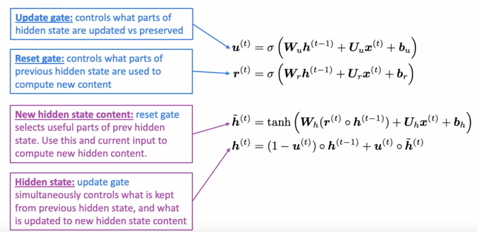

##《Vanishing Gradients, Fancy RNNs》

**1. 梯度消失爆炸**

)

$W_h$的最大特征值小于1或者大于1，或造成梯度消失/爆炸。

**Why vanishing gradients is a problem?**

梯度消失会使得模型总是根据near effects更新模型，而不是long-term effects。导致RNN更擅长学习sequential recency，而不是syntactic recency。

**Why exploding gradient is a problem?**

参数更新的幅度会很大，可能会导致Inf/NaN

如何解决？

######gradient cliping

**2.LSTM**

注意：h是输出，而c是cell state

为什么在输出层用tanh？

LSTM优点：
> LSTM可以解决梯度消失问题，但是并不能保证一定不会发生

不过，目前transformer正在取代LSTM成为主流。

**3.GRU**
没有cell state，只有hidden state，参数更少，计算更快。但和LSTM目前并没有明显的优劣之分。通常默认使用LSTM，尤其是数据更多的时候，效果不好可以专用GRU。

update gate类似LSTM中的forget gate和input gate的作用

通过设置update gate为0，即可存储之前的信息，从而避免梯度消失。

> 梯度消失并不只是RNN才有的问题，CNN，feeder-forward network也有，尤其是深层网络。lower layer更新的更慢，更难训练。有时候Deep network可能比shallow的效果更差。

一种常用解决方法，add direct connections：
- ResNet
- dense connection
- highway connection，与resnet相比有一个gate

**4.BRNN**

需要知道整个输入序列，这时可以优先使用BRNN。

**5.多层RNN**
通常2-4层，层数多的话需要用direct connection。
BERT用到了24层。