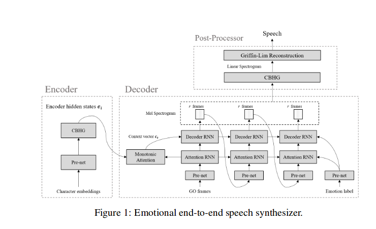
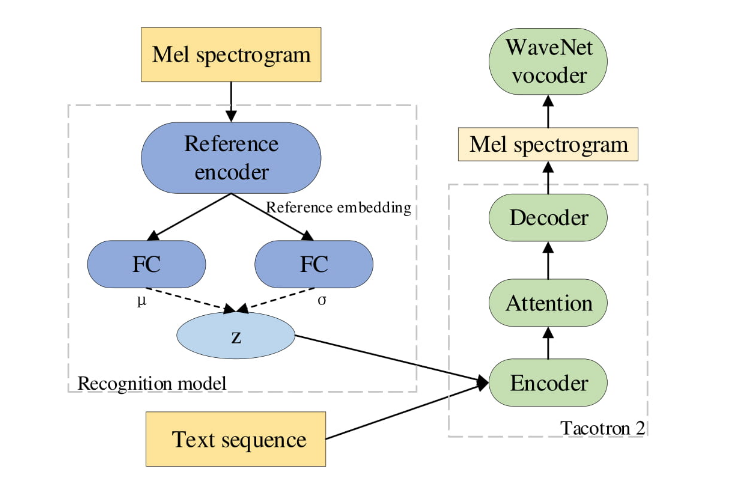
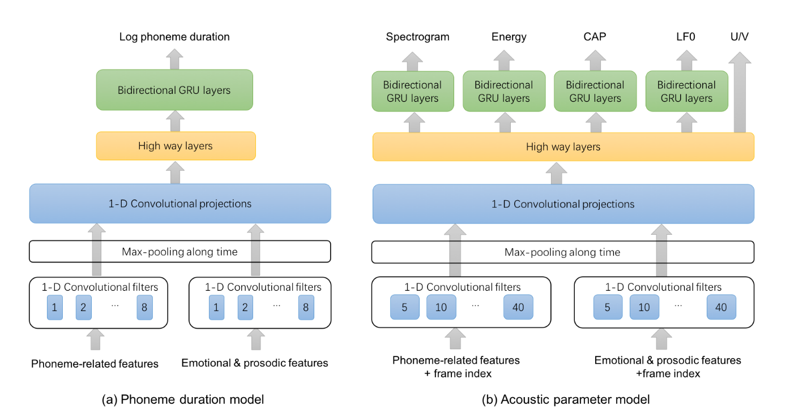
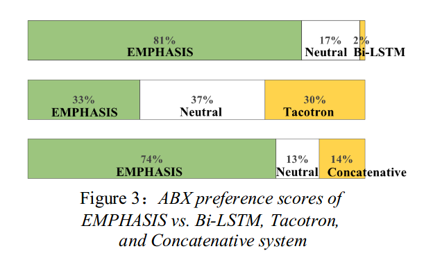

####Exploring Transfer Learning for Low Resoure Emotional TTS

**该论文用的finetune的方法，每次生成一种情感tts模型**

https://arxiv.org/pdf/1901.04276.pdf

该论文指出目前很多TTS系统，如Wavenet，Tacotron，WaveRNN，Char2Wav，Deep Voice都需要很多数据，有一个**DCTTS**需要的数据少一些，DCTTS只依赖CNN，不用RNN，两个GPU训练了15小时。

情感数据集目前都很少，解决少量数据训练的方法有transfer learning，multi-task learning。

《Asr-based features for emotionrecognition: A transfer learning approach》中用了一个ASR作为特征提取器来做情绪识别。

在TTS领域中，也有人研究了transfer learning，《Transferlearning from speaker verification to multispeaker text-to-speech synthesis》用来做多说话人TTS。

- 模型结构：基于DCTTS
- 数据集：EmoV-DB，有英文的男女演员的语句，和法语男演员的语句。每个演员用五种情绪读，Neutral， Amused， Angry， Sleepy， Disgust
- 预处理：原始模型是用LJ-speech训练的，采样率22050Hz，本数据集一样；trim slience，将https://github.com/Kyubyong/dc_tts 的top_db改为了20dB；音频文件中有一些是非言语表达，如笑声，打哈欠，叹气声，手动选择了amused dataset中没有这种情况的156句，sleepy中的361句，由于amused dataset中数据集太少了，之后针对于amused dataset，手动删掉了剩余82句中的笑声，这样总共就有了238句。
- 训练过程：LJ-speech有23.9h，该文章指出，原先想只训练audio部分，即不训练text encoder，但是合成出来的韵律有问题，他认为这样的attention没有适用于新的speaking style，因此训练了全体的。不知道为什么我固定encoder完全不行，后续还要再做实验。
- 实验：第一个实验评估了finetune的用处，测试了word accuracy；第二个实验测试了音频的质量，MOS。测试用的语句是Harvard sentences的100句。

后续可能会引入多说话人多情感。

----
####Speaking Style Adaptation In Text-to-speech Synthesis Using Sequence-to-sequence Models With Attentions

finetune了tacotron，
数据：
原始模型Blizzard Challenge 2011（16hours）
新的数据：normal style：2hours；Lombard style：30minutes。

---
#### Feature Based Adatation For Speaking Style Synthesis

为什么需要研究speaking style？
一种合适的speaking style可以生动地表达语音信号中包含的信息，增强人和机器的交流。同一种文本的语音在不同的speaking style下可能会表示不同的信息。

目前的adaptation主要分为三类：
- input feature-based adaptation and augmentation，如引入speaker codes，i-vector, d-vector，将他们与原始的文本特征结合在一起
- model based adaptation，保留模型的下面几层，只训练上面几层；学习hidden unit contribution。
- output feature transformation，如voice conversion。

这篇文章也是研究了finetune模型，指出现有的adaptation通常是adapt的是global level的信息，缺少局部信息。引入了以下两种信息：
- bottleneck feature
- residual feature

训练方法仍是finetune的方法，只训练上面几层。

**实验**
原始模型：5hours
interrogative style：25minutes

---

####Emotional End-to-End Neural Speech synthesizer

**tacotron的基础上进行改进，引入emotion label；改进了tacotron的一些问题，如exposure bias problem和attention alignment的irregularity。**

在tacotron基础上注入了一个learned emotion embedding e:

)
)

模型结构如下图所示：

其实就是将emotional label通过prenet之后，注入到attention RNN和decoder RNN。

参考《Listening while speaking: Speech chain by deep learning》，将**one-hot emotion label vector**注入attention RNN，具体方法如下：将prenet output concat之后，添加一层线性层保证维度和attention RNN input相匹配，decoder RNN也是类似的。

另外，本文还解决了exposure bias problem，这个问题会导致在长时间步之后，对齐有问题。因此这里采用了voiceloop中提出的semi-teacher-force training(STFT)，送入decoder的不再是ground truth，而是)，不过voiceloop原始的方法是还添加了一个噪声项。但是这样做的话速度会不会特别慢？？仅仅添加一个噪声项是否可行？？？

实验：
用的<text, audio, emotion label>来做数据集，每个女演员用六种不同的情绪来读：neutral，angry，fear，happy，sad，surprise。共21小时。emotion vector用的是64隐藏层，dropout ratio=0.5

关于attention alignment的预测：
再用非情绪语音进行训练时，发现attention alignment的中间部分会出现一些irregularities。又由于alignment的shapness会影响到生成音频的质量。attention alignment有两个输入，一个是从attention RNN的hidden state，一个是encoder的encoding。基于此，提出了以下两种改进：
- utilization of context vector，),即利用上一时刻的context vector。
- residual connections in CBHG.在text encoder的CBHG模块加入residual，)。

---

#### Principles for learning controllable TTS from annotated and latent variation

语音其实含有很多丰富的变量，不能由文本代替，比如speaker identity，speaker rate，emotion，adjustments to enhance communication with the listener（speaking style，prosody，emphasis，entrainment等），环境因素（如背景噪音）。

但是目前的TTS系统没有对这些变量进行建模，输出的音频都是平均的，平滑的。为了减少这些变量的影响，通常训练数据为单一说话人在安静的录音室中录制一致的语音。但是更好的方式是给variation打标签并学习，但是成本又太高了。目前有一些工作指出多说话人TTS甚至可以产生比单一说话人更好的音质，说明我们可以利用这种diversity。

__标签未知的情况下，一个简单的方法是与synthesiser一起学习control parameters。联合优化network weights和unknown control input可以用深度学习反向传播很容易地进行联合优化，称为discriminant condition codes（DCC），已经用来做speech recognition和speech synthesis to new speakers，或者learned control vectors。__
后续需要看下这些论文

Sentence-level  control  vectorsfor deep neural network speech synthesis用到了儿童有声书做数据集，和本文方法有点类似，不过论文是15年的了。

---

### VAE相关

---
####Learning Latent Representations for Speech Generation and Transformation

https://arxiv.org/pdf/1704.04222.pdf

**用VAE分解隐变量**

speech waveforms有复杂的分布，体现出variance，linguistic content，speaking style，dialect，speaker identity，emotional state，environment，channel effect。

输入数据x为固定长度的语音，TxH，和图片不同的是，语音只在时间轴上面有**平移不变性**，因此采用了和文献《Learning word-like units from jointaudio-visual analysis》相类似的方法，第一层卷积利用的是1xF的卷积核，后面几层用的是wx1的,文献《Unsupervised representa-tion learning with deep convolutional generative adversarial networks》指出，用时间轴上stride size>1替代pooling做下采样。最后一层卷几层的输出展平，送入全连接层，再之后送入gaussian parameter layer对隐变量建模。
对于高斯层，没有使用激活函数，表示对输出不做bound，但是其它层，选择了tanh。除了高斯层，其他都用了BN。

**具体分解**
属性用记号a表示，属性的值用记号r表示。
假设一：conditioning on some attribute a being r，比如phone being /ae/，z的先验分布依然是高斯。
假设二：定义k个独立的属性。

假设我们希望修改语句$x^{(i)}$的属性$a_k$,如说话人从$r_s$转到$r_t$，则latent attribute shift $v_{r_s-r_t}=μ_{r_t}-μ_{r_s}$。
可以通过以下方法修改$x^(i)$:
$z^(i)~q_\fai$

**实验**
TIMIT 630说话人，每人10句话。
VAE和AE对比。
修改的是phone和说话人，没有涉及到情感。

----

####LEARNING LATENT REPRESENTATIONS FOR STYLE CONTROL AND TRANSFER INEND-TO-END SPEECH SYNTHESIS

__tacotron2+VAE，进行style transfer，效果胜于GST，ICASSP 2019__
__Expressive speech synthesis via modeling expressions with  variational autoencoder interspeech2018是用VAE+voiceloop：__

- 本文可以进行style control
- 本文是端到端的

模型结构：

recognition model用的是GST的reference encoder+全连接得到隐变量z的期望和方差。为了匹配维度，z需要先送入一个FC，之后加上text encoder state。

实验：105 hour Blizzard Challenge 2013，http://home.ustc.edu.cn/~zyj008/ICASSP2019/

---

#### Expressive speech synthesis via modeling expressions with  variational autoencoder

__VAE+voiceloop   interspeech 2018__

https://www.kakuzawa.com/VAELoopDemo/

模型：

实验： 

- 多说话人：VCTK，5hours of 21 speakers
- 10hours Blizzard Challenge 2012

---

#### Modeling and Transforming Speech Using Variational Autoencoders

#### Voice conversion from non-parallel corpora using Variational auto-encoder

#### Neural Discrete Representation Learning

#### Voice conversion from unaligned corpora using variational au-toencoding wasserstein generative adversarial networks,

---

####Robust And Fine-grained Prosody Control of End-to-end Speech Synthesis

ICASSP2019

这篇文章主要解决两个问题：
- GST模型没有考虑具体时刻下如何控制Prosody，他们的Prosody embedding是固定长度的；
- 如果source speaker和target speaker的pitch range差距太大，结构不够robust。

这里提到了一个Prosody标签。ToBI，但是有文章说这个标签有很多问题。

__Baseline Model__:基于tacotron的更改。
speaker embedding vector s，用了embedding lookup layer。
$e_{1:l_e}=Encoder(x_{1:l_e})$
$α_i=Attention(e_{1:l_e},d_{i-1})$
$e_i^{'}=\sum_jα_{i,j}e_j$
$d_i=Decoder(e_i^{'},s)$
其中，e，p，d分别是encoder state，Prosody，decoder state
和GST类似，这里的reference speech也要通过reference encoder，先经过2D卷积，再经过单层GRU，最后一个GRU的输出是固定长度的Prosody embedding p。如果我们将每个GRU的输出拼起来，就可以得到不定长的prosody embedding $p_{1:N}$
__proposed model__:speech-side control和text-side control，从而进行prosody control。变长的prosody embedding分别送入decoder或者encoder。因此，需要做align和downsample，使得prosody embedding匹配decoder的time-step和encoder的time-step。具体而言，decoder state长度和prosody embedding具有线性关系，直接下采样即可，而encoder state和Prosody embedding则没有关系，因此这里用了scaled dot-product attention，encoder state作为query，prosody embedding作为key和value。

__在tacotron结构上做了以下更改__：CoordConv做第一层卷几层。

----
#### EMPHASIS:An Emotional Phoneme-based Acoustic Model for Speech Synthesis System

__依赖标注，参数式，interspeech2018，https://ttsdemos.github.io/__

introduction中提到了两篇论文7,8是17和18年的，需要看下

EMPHASIS采用的是cascade model，更加稳定。
TTS系统的linguistic feature通常包含phoneme identification，tone（如中文），stress（如英文），prosody structure，syntactical structure和emotion type，这些特征都要用one-hot vector表示。由于phoneme-related features，包括phoneme identification，tone，stress，对于决定duration和acoustic feature而言是很强的特征，而emotional，prosodic feature相对较弱，这就会导致训练时，容易忽略后者，因此我们将他们分成两组，通过网络加强后者。

__数据__：14小时汉语+3.5小时英语，一个说话人。30%疑问句，10%感叹句。（标贝数据目前只有570句问句，306句感叹句）标签：phoneme identity(specifically, one-hot  representation  of initials  and finals of Mandarin Pinyinandphonemes of English），tone of Mandarin syllable, stress of English syllable;the emotional & prosodic  linguistic features  include prosodic break,  prosodic level, word segmentation of Mandarin, syntactic level, part-of-speech tag and type of emotion, etc.
__实验__：ABX test，EMPHASIS，Tacotron，Bi-LSTM，Concatenative，样音中断句韵律更自然，主要为疑问句，没有明显情绪。

---
#### Multi-reference Tacotron by Intercross Training for Style Disentangling,Transfer and Control in Speech Synthesis

__投稿interspeech2019，在GST-tacotron基础上引入了multi-reference encoder__

定义：
- style class：speaker，emotion，prosody，可以拓展到其他方面
- style instance：**speaker class**有300个不同的speaker，**emotion class**有happy，sad，angry，fear，confuse，surprise，neutral； 
**prosody class**:
    - news: relative fast, normal
    - story: many transitions and breaks
    - radio: relative slow, deep and attractive voice
    - poetry: slow, obeys ruls of rhyming
    - call-center： relative fast, sweet

数据：BAIDU Speech Department，conditioned on Mandarin phonemes and tones

